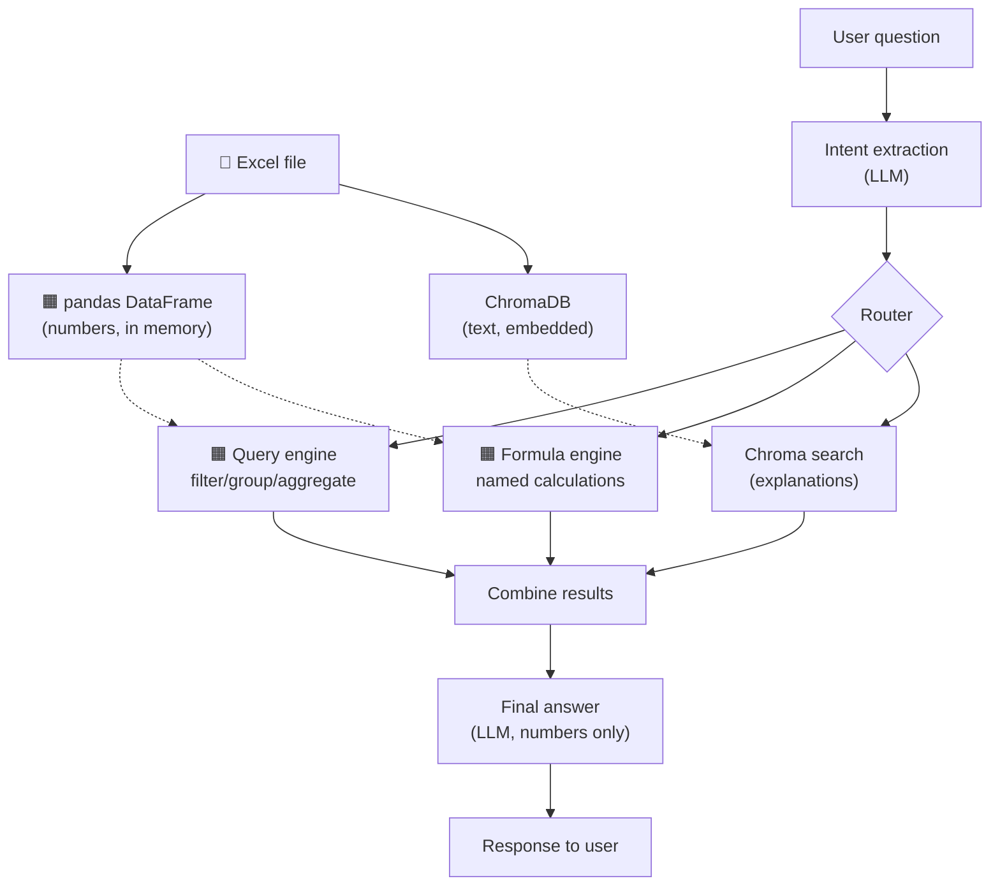
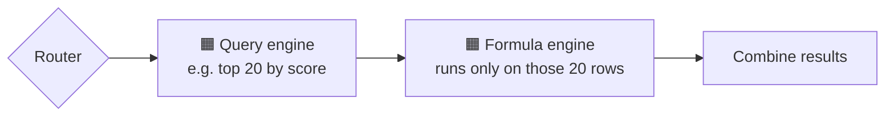

# RAG + Calculation-Backend Chatbot — Flow

Excel/pandas as the structured store · ChromaDB as the vector store · no SQL anywhere

## How to read this

- Excel loads once into pandas (numbers) and ChromaDB (text) — top row.
- Each question goes through the router to the right engine, then the results get combined into one answer — bottom row.
- Dashed arrows = engines reading already-loaded data, never touching Excel directly.
- 🟧 = vectorized pandas step · 📗 = where Excel enters the system

**Always applied:** results are filtered to the caller's own portfolio first, every query is checked before it touches pandas, and only masked customer IDs ever get embedded.

## When formula needs query's output first

Sometimes it's not query *or* formula — it's query *then* formula, on the same rows (e.g. "efficiency index for my top 20 by propensity"). The router then runs them as a chain instead of two separate branches:

