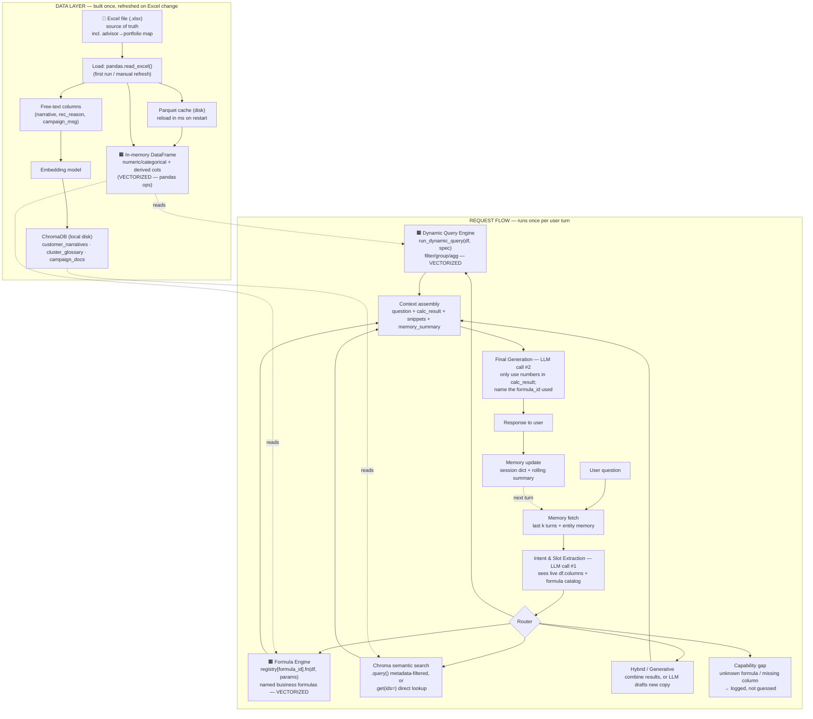

# RAG + Calculation-Backend Chatbot — Flow

Excel/pandas as the structured store · ChromaDB as the vector store · no SQL anywhere

## How to read this

The diagram has two halves. **Data layer** (top box) happens once, at startup
or whenever the Excel file is refreshed — it's where the `.xlsx` file is
loaded, split into a numeric/categorical DataFrame (cached to Parquet) and a
free-text stream (embedded into ChromaDB), and never touched again until the
next refresh. **Request flow** (bottom box) happens once per user turn — it's
the actual chat request path: intent extraction figures out what's being
asked, the router sends it to whichever engine can answer it (dynamic query,
formula, semantic search, or a hybrid/generative combination), and the
results get assembled and narrated back. The two dashed arrows crossing from
the data layer into the request flow show that the query and formula engines
never re-read Excel — they operate on the DataFrame that's already sitting in
memory.

**Always applied, regardless of route:** row-level security scopes the DataFrame to the caller's portfolio *before* any filter runs · every `filter_expr` / `derived_columns.expr` is checked against an AST whitelist before it touches pandas · only `masked_mpxn` is ever embedded, never unmasked identifiers.

**🟧 = vectorized pandas operation** (whole-column ops, not row loops) · **📗 = where Excel data actually enters the system** (only here — everything downstream reads the in-memory DataFrame or Parquet cache, never the Excel file directly).
